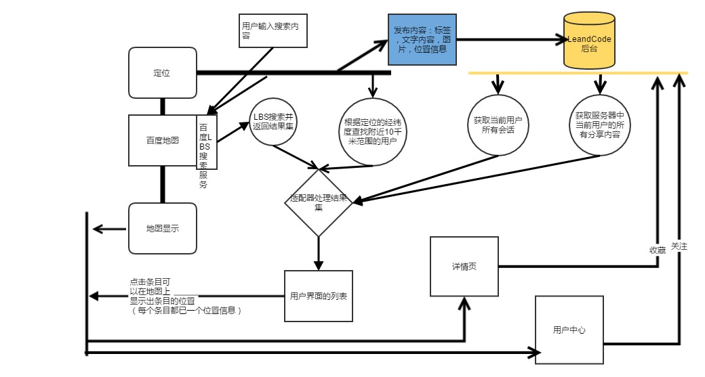

**项目结构采用多模块依赖编译的方式。部分采用MVP的设计模式，主要体现在：登录注册，聊天界面，**
**主页面，内容详情页。**
### Module
* app 主模块
    此模块下包含所有的页面控制，错作逻辑。
* base 项目通用的内容，包括基类，自定义view等
    提供了Activity,Fragment的基类与接口，方便集成使用，以及用到的自定义view
* map 百度地图的封装模块
    百度地图功能的封装集成，主要是官方的动态库，定位帮助类，地图操作类
* RTPermission Android运行时权限处理模块
    Android 6.0以上部分危险权限需要运行时申请
    [说明](http://blog.csdn.net/lmj623565791/article/details/50709663)
* model 数据模型模块
    与后台通信的实体类封装
    
### 实体字段说明：

**AVOUser**
* user LeandCode本身的user字段
* shareLocation 是否共享自己的位置信息，默认共享
* nickname 昵称
* username 用户名
* mobile 手机号码
* avatar 头像文件
* lastLocation 退出应用时的位置信息（经纬度）
* friends 用户的好友（保存关注该用户的其他用户【一对多关系】）

**AVOShop**
* uid 通过百度地图搜索到的店铺的id
* name 店铺名称
* address 店铺地址
* phone 店铺电话
* location 店铺位置（经纬度）
* likes 用户收藏（一对多关系）

**AVOShare**
* user 分享者
* uid 分享内容的id，可能是AVOShop的id,也可能是AVOFeed的id
* describe 分享的描述信息
* jsonObject 保存实际分享内容的json格式字符串
* like 分享给的用户，可以多个

**AVOLabel**
* creator 创建者 
* label 标签内容

**AVOFeedImage**
* creator 图片的创建者
* feed 归属于哪一个AVOFeed
* image 图片文件 对应AVFile

**AVOFeed**
* creator 内容的发布者
* labels 内容的所有标签
* isPublic 是否是公开的内容
* content 发布的文字内容
* location 发布内容的位置信息（经纬度）
* likes 喜欢这个内容的所有用户

**AVOFavorite**
* owner 收藏的用户
* feed 收藏的内容 对应AVOFeed

## 一、使用的技术栈
* LeandCode（数据存储，实时通信）
    [文档](https://tab.leancloud.cn/docs/)
* EventBus（组件间通信）
    [项目地址](https://github.com/greenrobot/EventBus)
    [使用介绍](http://www.jianshu.com/p/31e3528ca7e5)
* BaiDu Map SDK（地图模块）
* Glide(图片加载显示)
    [项目地址](https://github.com/bumptech/glide)
* Picture-Library(图片选择裁剪压缩)
    [项目地址](https://github.com/LuckSiege/PictureSelector)

## 二、自定义View相关
* LabelTextView（标签式TextView）
* SlidingMenu(侧滑菜单)
* TagCloudView(标签云控件)
* materialsearchview（一个材料设计风格的搜索view）

### app Module
- activity (APP页面)
- adapter （列表使用的适配器）
- event （用于EventBus的通知事件）
- feature (登录注册契约)
- helper （一些工具）
- im （即时通信相关：处理聊天的事件通知）
- mvp （MVP结构）
    - contract（契约）
    - model（模型）
    - presenter（处理）
    
    

# 项目流程

